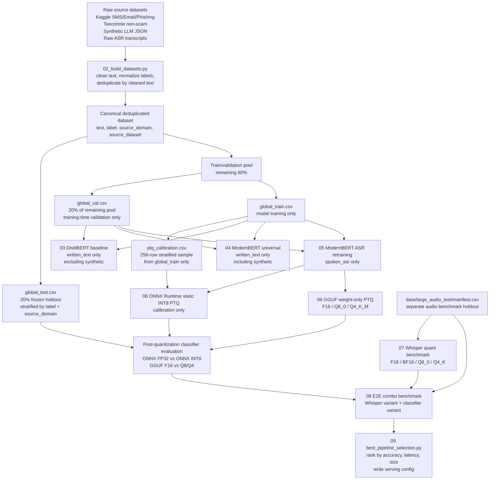

# Data Partition Flow

This diagram documents which source data is used by each pipeline step and which splits are protected from leakage.

## Split Contract

- `global_train.csv`: used for model fitting. It is the only source for `ptq_calibration.csv`.
- `global_val.csv`: used for training-time validation and checkpoint/model selection.
- `global_test.csv`: frozen final classifier holdout, used for post-training and post-quantization evaluation.
- `ptq_calibration.csv`: train-only calibration split for ONNX Runtime static INT8 PTQ. It is asserted to be disjoint from validation and test.
- `data/large_audio_test/manifest.csv`: separate audio benchmark holdout for ASR and full pipeline latency/quality tests.
